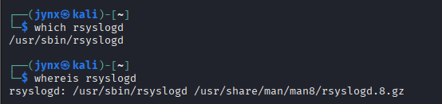

# CHAPTER 11 -  THE LOGGING SYSTEM

Linux users must understand log file management since these files record operating system and application events, errors, and security notifications. The system automatically logs data according to configurable rules that will be covered in this chapter. From an attacker's perspective, log files can reveal information about a target's behavior and identity, while simultaneously creating a record of the attacker's own presence on compromised systems. Attackers need to understand both what intelligence they can extract from logs and what traces of their activities might be recorded, enabling them to conceal their footprint. Conversely, system administrators must master logging controls to detect intrusions, analyze attack patterns, and identify perpetrators. This chapter demonstrates log file analysis and configuration, evidence removal techniques, and methods to disable logging entirely. We'll begin by examining the logging daemon.

## [11.1]  THE RSYSLOG LOGGING DAEMON

### **Linux uses a daemon called `syslogd` to automatically log events on your computer.**

Linux operating systems use a background service called **`syslogd`** to handle automatic event logging.

**Daemon**: A daemon is a background program that runs continuously without direct user interaction. It operates "behind the scenes" to perform system tasks automatically.

**syslogd**: This is the specific daemon responsible for system logging. The "d" at the end stands for "daemon." It's the program that collects, processes, and stores log messages from various parts of the system.

**Automatic logging**: The daemon works without requiring manual intervention - it constantly monitors the system and records events as they happen.

**Events**: These include system activities like user logins, application errors, security alerts, hardware messages, and other operational information.

Essentially, syslogd acts as a central collection point that gathers log messages from the kernel, applications, and system services, then organizes and stores them in appropriate log files (typically in `/var/log/` directory). This allows administrators to review what has happened on the system for troubleshooting, security monitoring, or forensic analysis.

Modern Linux systems often use more advanced logging systems like `rsyslog` or `systemd-journald`, but they serve the same fundamental purpose as the traditional syslogd.

Different Linux distributions use various versions of **`syslog`**, such as **`rsyslog`** and **`syslog-ng`**. While these variants function in largely the same way, there are some small distinctions between them. Because Kali Linux is based on Debian, and Debian includes **`rsyslog`** as its standard logging system, this utility will be our primary focus.




## [11.2]  THE RSYSLOG CONFIGURATION FILE

Like nearly every application in Linux, rsyslog is managed and configured by a plaintext
configuration file located, as is generally the case in Linux, in the /etc directory. In the
case of rsyslog, the configuration file is located at **`/etc/rsyslog.conf`**.


The `rsyslog` rules determine what kind of information is logged, what programs have
their messages logged, and where that log is stored.

As an attacker, this allows you to find out what is being logged and where those logs are written so you can delete or obscure them. Or, as a Defense SOC analyst or Forensic Investigator you can ensure every crucial and vital application and critical system domains are regularly logged and documented or go a step further to also set-up automatic back up or secondary storage for the logs to avoid tampering or entire wiping as is generally observed during stealth attacks.


## Understanding the Rule Format

**Basic syntax:** `facility.priority`    `action`

- **Facility**: What program/service is generating the log
- **Priority**: What level of importance to log
- **Action**: Where to send the log

## [11.3]  AUTOMATICALLY CLEANING UP LOGS WITH `LOGROTATE`

Log files consume disk space and will eventually fill your hard drive if not regularly removed. However, deleting them too often means you won't have historical logs available when you need to troubleshoot issues later. The logrotate tool helps you strike the right balance between these conflicting needs through log rotation - a process that systematically archives current log files to a different location while creating new, empty log files. These archived files are automatically cleaned up after a predetermined time period. Your system already performs log rotation automatically via a scheduled cron job that uses the logrotate utility. You can customize how often log rotation occurs by modifying the configuration settings in the /etc/logrotate.conf file.


**Time Unit and Frequency**: You can specify the time period for rotation , with weekly being the default. The rotation frequency is set to **every four weeks** , which works well for most users. 
However, you can adjust this based on your needs - set it to 1 week if you check logs frequently and want to save disk space, or extend it to 26 weeks (six months) or 52 weeks (one year) if you have ample storage and need logs for long-term forensic analysis.

**File Creation and Compression**: The system automatically generates fresh, empty log files when old ones are rotated . You also have the option to compress archived log files to save additional space .

**Rotation Process**: During each rotation cycle, log files follow a sequential numbering system. The current log file (like /var/log/auth) gets renamed to /var/log/auth.1, which then becomes /var/log/auth.2, and so forth. When you reach your maximum retention limit (for example, keeping four backup sets), the oldest file (/var/log/auth.4) gets permanently deleted instead of being moved to /var/log/auth.5, ensuring you maintain only the specified number of historical log files.


## [11.4]  REMAIN STEALTHY!!!

After gaining access to a Linux system, attackers often want to eliminate logging and erase traces of their presence to avoid detection. Several methods exist for this, each with different trade-offs in terms of risk and effectiveness.

**Removing Evidence**
The first step involves eliminating logs that document the intrusion. One approach is to manually edit log files and delete specific entries line by line using standard file deletion methods. However, this approach has significant drawbacks: it's time-intensive, creates noticeable time gaps in the logs that raise suspicion, and deleted files can typically be recovered by experienced forensic analysts.

**A More Secure Approach**
A superior and safer method involves using the shred command to destroy log files. While conventional file deletion methods still allow skilled investigators to recover deleted data, shred offers a more thorough solution. This built-in Linux utility doesn't just delete files—it overwrites them multiple times with random data, making data recovery significantly more difficult and providing attackers with better protection against forensic analysis.


**Command breakdown:**

- **`shred`** - The base command that securely deletes files by overwriting them multiple times
- **`f`** - **Force** flag
    - Forces the operation to proceed
    - Changes file permissions if necessary to allow writing
    - Continues even if some operations fail
- **`n 10`** - **Number of overwrites**
    - Specifies how many times to overwrite the file with random data
    - `10` means it will overwrite each file 10 times
    - More overwrites = more secure deletion but takes longer
    - Default is typically 3 passes if not specified
- **`/var/log/auth.log.*`** - **Target files**
    - The file path and pattern to shred
    - `*` is a wildcard that matches any characters after `auth.log.`
    - This targets rotated log files like `auth.log.1`, `auth.log.2`, `auth.log.3.gz`, etc.
    - Does NOT target the main `auth.log` file (no dot after it)

**What it does:**

The command attempts to securely delete all rotated authentication log files by overwriting them 10 times with random data, making recovery nearly impossible, even with forensic tools.

### DISABLE Logging

Another method for hiding intrusion activity is to turn off the logging system entirely. Once an attacker gains system control, they can immediately shut down logging to prevent the system from recording their subsequent actions. This approach requires administrator-level access.
To completely disable logging, an attacker can halt the rsyslog service, which is responsible for managing system logs. Linux services follow a standard control pattern using this format:

> `service servicename start|stop|restart`
> 

Once executed, the Linux system will cease creating log entries until the service is manually restarted. This allows the attacker to perform activities on the compromised system without generating any audit trail or evidence in the log files.
This technique effectively creates a "blind spot" in system monitoring, making it much harder for administrators or forensic investigators to track what happened during the period when logging was disabled.


There's still a related component called `syslog.socket` that remains active and could potentially restart the logging service.

**Breaking it down:**

- **`rsyslog.service`** - This is the main logging daemon that was successfully stopped
- **`syslog.socket`** - This is a "socket unit" that listens for incoming log messages
- **"triggering units are still active"** - The socket can automatically restart (trigger) the rsyslog service when log messages arrive

**What this means practically:**

1. **Logging might resume automatically** - If any program tries to send a log message, the `syslog.socket` will detect this and automatically restart the `rsyslog.service`
2. **The stop isn't complete** - You've only partially disabled logging

**To fully disable logging, you'd need to stop both:**

```bash
bash
sudo systemctl stop rsyslog.service
sudo systemctl stop syslog.socket
```

Or disable them entirely:

```bash
bash
sudo systemctl disable rsyslog.service
sudo systemctl disable syslog.socket
```

This socket-based activation is a systemd feature designed to make services more efficient - they only run when actually needed, but it also means they can restart automatically, which defeats the purpose of stopping them for stealth operations.
