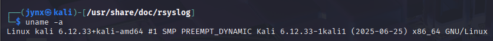

# CHAPTER 12 - MANAGING THE LINUX KERNEL

Every operating system consists of **two primary parts**. The core component is the **kernel**, which sits at the heart of the system and oversees all operations - from memory allocation and CPU management to display output. The second part, commonly called **user space**, encompasses virtually all other system elements.
The kernel operates as a secure, restricted zone accessible only to administrators and other high-privilege users. This protection exists because kernel access grants extensive control over the entire system. Therefore, most operating systems limit regular users and applications to user space, where they can perform necessary tasks without gaining system-level control.
Kernel access enables users to modify the operating system's functionality, appearance, and behavior, but it also carries the risk of system crashes and complete failure. Even with these dangers, system administrators sometimes need careful kernel access for maintenance and security purposes.

## [12.1] WHAT IS A KERNEL MODULE?

The kernel functions as the operating system's command center, orchestrating all operations and mediating between user applications and hardware components like processors, memory, and storage devices. Linux uses a monolithic kernel design that supports dynamic module integration, allowing components to be added or removed as needed.
Kernel updates are sometimes necessary to incorporate new device drivers for graphics cards, Bluetooth adapters, or USB peripherals, along with filesystem drivers and system extensions. These components must integrate directly into the kernel for proper operation. While some systems require complete kernel rebuilding, compilation, and restart to add drivers, Linux offers the ability to load certain modules dynamically without this lengthy process.
These dynamic components, called loadable kernel modules (LKMs), require deep kernel access to function, which creates significant security vulnerabilities. Malicious software called rootkits exploits this necessity by infiltrating the kernel through LKMs. Once malware establishes itself at the kernel level, attackers can seize complete system control.
When hackers successfully convince Linux administrators to install compromised modules, they gain not only system access but also the ability to manipulate what the system reports about running processes, network ports, active services, storage capacity, and virtually all other system information. By tricking administrators into installing seemingly legitimate device drivers containing hidden rootkits, attackers can achieve total system and kernel dominance.
This exploitation method represents one of the most dangerous ways rootkits compromise Linux and other operating systems. Mastering LKM concepts is essential for both effective Linux administration and understanding sophisticated attack vectors.

## [12.2] CHECKING THE KERNEL VERSION

how to check your current system kernel and if it is working:

- `uname` = Unix name command
- `a` = "all" flag (shows all available information)

Alternatively, you can also check using:

**What is /proc/version:**

- A virtual file in the `/proc` filesystem (procfs)
- Contains kernel version information in a single line
- Automatically generated by the kernel
- Similar to `uname -a` but with additional compiler details

## [12.3] KERNEL TUNING WITH SYSCTL

Using appropriate commands allows you to customize your kernel by adjusting memory settings, activating network capabilities, and strengthening security against external threats. Contemporary Linux kernels rely on the `sysctl` utility for kernel parameter modification. Any adjustments made through sysctl are temporary and will revert when the system restarts. For persistent changes, you must directly modify the `sysctl` configuration file located at `/etc/sysctl.conf`.
Exercise **extreme caution** when working with `sysctl`, as improper use without adequate knowledge and experience can render your system unable to boot or function properly. Always thoroughly evaluate your intended changes before implementing any **permanent modifications** to avoid system failure.

To illustrate `sysctl` usage, consider enabling packet forwarding for man-in-the-middle (MITM) attacks. In MITM scenarios, attackers position themselves between communicating systems to capture transmitted data. Since traffic flows through the attacker's machine, they can monitor and potentially modify the communications. Packet forwarding activation is one method to establish this traffic routing.

When examining the output or filtering for IPv4 settings using `sysctl -a | less | grep ipv4.ip`, you'll find the relevant configuration line(s):

The parameter `net.ipv4.ip_forward = 0` controls the kernel's ability to forward received packets to their destinations - essentially acting as a relay that receives packets and retransmits them. The default value of 0 disables this forwarding capability. To activate IP forwarding, modify the value from 0 to 1 using this command:

`sysctl -w net.ipv4.ip_forward=1`

This change allows the system to route packets between network interfaces, enabling the MITM attack setup.
→ I'm not illustrating how to make the change permanent but I don't think it needs a Nicolas Tesla to figure that out themselves- ***insert a wink emoji.***

## [12.4] MANAGING KERNEL MODULES

Linux provides multiple methods for kernel module management. The traditional approach involves using commands from the `insmod` collection - where **`*insmod*`** means "insert module" and is designed specifically for module handling. An alternative method utilizes the `modprobe` command, which will be covered later in these series’ chapters. In this section, we'll use the `lsmod` command from the `insmod` toolkit to display the currently loaded kernel modules:

The `lsmod` command displays all kernel modules along with details about their memory usage and interdependencies. For example, the `nfnetlink` module - a message-based communication protocol linking kernel and user space - occupies 16,384 bytes and serves both the `nfnetlink_log` and `nf_netlink_queue` modules.
Within the `insmod` toolkit, you can add modules using `insmod` and eliminate them with `rmmod` (remove module). However, these commands have limitations and don't properly handle module dependencies, potentially causing kernel instability or system failure. Due to these risks, current Linux distributions have incorporated the `modprobe` command, which automatically manages dependencies and provides safer module loading and removal operations. We'll examine `modprobe` shortly, but first let's explore how to gather additional module information.

To obtain detailed information about kernel modules, you can use the `modinfo`command. The command structure is simple: type `modinfo` followed by the specific module name you want to investigate. For instance, if you need basic details about the Bluetooth kernel module that appeared in your earlier `lsmod` output, you would use this command:

## [12.5] ADDING and REMOVING KERNEL MODULES

Let's practice inserting and removing a sample module to become comfortable with this procedure. Suppose you've just installed a new graphics card and need to add its drivers. Keep in mind that device drivers typically integrate directly into the kernel to obtain necessary access for proper operation. This direct kernel access also creates opportunities for malicious actors to embed rootkits or surveillance tools.

For demonstration purposes (don't execute these actual commands), imagine we want to install a new graphics driver called `KillAllTheFiles`. You would add it to your kernel using:

> `modprobe -a KillAllImageFiles`
> 

To verify successful module loading, run the dmesg command, which displays the kernel's message buffer, then filter for "image" to check for any error indicators:

> `dmesg | grep image`
> 

Any kernel messages containing "video" will appear here. If no output displays, there are no messages with that term.

To remove the same module, use the identical command with the -r (remove) option:

> `modprobe -r KillAllImageFiles`
> 

While loadable kernel modules provide convenience for Linux users and administrators, they represent a significant security vulnerability that professional hackers should understand. As mentioned previously, LKMs can serve as ideal delivery mechanisms for introducing rootkits into the kernel and causing system damage.
