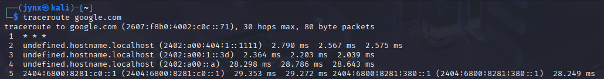

# CHAPTER 13 - BECOMING SECURE AND ANONYMOUS

In today's digital landscape, virtually all online activities are monitored and recorded. Various entities—from major tech companies like Google that monitor search queries, browsing habits, and email communications, to government agencies such as the NSA that document comprehensive online behavior—are continuously collecting, organizing, and analyzing our digital footprints for their own purposes. It's crucial for everyday users, and especially those with heightened security concerns, to learn techniques for reducing this surveillance and maintaining greater privacy while browsing the internet. This chapter explores **four approaches** for achieving more anonymous web navigation: using the **Tor network**, **employing proxy servers**, utilizing **virtual private networks**, and implementing **secure encrypted email services**. While no single approach can guarantee complete protection from surveillance, and determined actors with sufficient resources and time may still be able to trace activities, these strategies will significantly improve your privacy and make tracking considerably more difficult.

## [13.1] HOW THE INTERNET GIVES US AWAY?

**HOW ONLINE ACTIVITIES ARE MONITORED**

Let's examine some fundamental ways that internet usage can be traced, though we'll keep this overview broad rather than diving into every tracking technique or providing exhaustive detail on any single method—such comprehensive coverage could fill an entire volume.

Your internet protocol address serves as your primary digital identifier as you browse online. When your device sends information across the network, this data typically includes your IP address as a marker, creating an easily traceable record of your online behavior. Additionally, major email providers like Google scan the content of your messages, analyzing them for specific terms to deliver targeted advertisements more effectively. While numerous other sophisticated surveillance techniques exist that require greater time and resources to implement, these represent the primary concerns we'll address in this section.

Let's examine how IP addresses compromise your online privacy. Every data packet you transmit over the internet includes both the sender's and recipient's IP addresses. This addressing system allows the packet to navigate to its intended destination and enables responses to find their way back to you. Each packet travels through a series of internet routers—typically making between 20-30 jumps, though usually reaching its destination in under 15 hops—before arriving at its target and returning to the original sender.

During this journey across the network, anyone who intercepts these packets can determine the sender's identity, track the packet's path, and identify its final destination. This mechanism enables websites to recognize returning visitors and automatically log them in, while also allowing others to monitor your browsing history. To observe the specific route your packets take to reach a particular destination, you can utilize the traceroute utility by entering the command followed by the target IP address or domain name, which will map the path your data travels.

## [13.2] THE ONION ROUTER SYSTEM

During the **1990s**, the United States Office of Naval Research initiated development of a system for covert internet navigation designed for intelligence operations. Their objective was to create a distinct router network, separate from standard internet infrastructure, that would encrypt data transmissions and retain only the unencrypted IP address of the immediately preceding router—keeping all other routing information encrypted throughout the journey. The goal was to prevent anyone monitoring network traffic from identifying either the source or final destination of transmitted data. This initiative evolved into "**The Onion Router (Tor) Project**" by 2002 and is now publicly accessible for secure, anonymous web browsing.

**Tor's Operating Mechanism**

Rather than using conventional internet routers that face extensive monitoring, Tor routes data packets through its own network comprising over 7,000 routers worldwide, maintained by volunteers who contribute their computing resources. Beyond utilizing this independent routing infrastructure, Tor applies encryption to the data content, destination information, and sender's IP address for each packet. As packets move through the network, information gets encrypted at each junction and subsequently decrypted upon arrival at the next point. This process ensures that each packet contains only routing information from the immediately previous connection point, not the original sender's IP address. Anyone intercepting this traffic can only identify the preceding router's IP address, while website operators can only see the final router that delivered the traffic. This design provides substantial anonymity protection across internet communications.

To access Tor, simply download and install the Tor browser from the official Tor Project website. Once set up, the interface resembles any standard web browser and functions similarly. Using this browser routes your internet activity through the alternative router network, enabling website visits without surveillance by monitoring entities. The downside is significantly slower browsing speeds, as the limited number of available routers creates bandwidth constraints within this network.

Beyond accessing standard internet websites, the Tor browser also provides entry to the dark web—a collection of sites that require anonymity and are accessible exclusively through Tor, identifiable by their .onion domain extensions. While the dark web has gained notoriety for illicit activities, it also hosts various legitimate services. However, users should exercise caution when exploring the dark web, as they may encounter content that many find disturbing or objectionable.

**Security Issues**

US intelligence agencies and other countries' security services view the Tor network as a national security risk, as they believe this anonymous system allows hostile nations and terrorist groups to communicate undetected. Consequently, multiple well-funded research initiatives are actively attempting to compromise Tor's anonymity features. Government authorities have successfully defeated Tor's anonymity protections in the past and will probably do so again in the future.

The NSA operates its own Tor relay nodes, which means your internet traffic might pass through NSA-controlled servers when using Tor. This becomes particularly problematic if your data exits through NSA nodes, since exit relays can always see your final destination. The NSA employs a technique called traffic correlation analysis, examining traffic flow patterns to identify users, which has successfully compromised Tor's anonymity. While these government efforts to crack Tor may not impact its ability to hide your identity from commercial entities like Google, they could reduce the browser's capacity to maintain anonymity from intelligence organizations.

## [13.3] PROXY SERVICES

An alternative approach to internet anonymity involves using **proxy servers** - intermediary systems that relay traffic between users and destinations. Users connect to a proxy server, which assigns its own IP address to the traffic before forwarding it. Return traffic follows the same path back through the proxy to the user. This process makes internet activity appear to originate from the proxy server rather than the user's actual IP address.
While proxy servers typically maintain traffic logs, investigators would need legal authorization such as subpoenas or search warrants to access these records. For enhanced anonymity, users can employ multiple proxies in sequence - a technique called proxy chaining.
Kali Linux includes a powerful proxy tool called **`proxychains`** for traffic obfuscation. The basic command structure is simple:

> `proxychains [command]`
> 

You can include IP addresses as parameters. For instance, to perform an anonymous network scan using `nmap` through `proxychains`, you would use:

> `proxychains nmap -sT -Pn [IP address]`
> 

This routes the `nmap` stealth scan command through a proxy chain to the specified IP address. The `proxychains` tool automatically constructs the proxy chain, eliminating manual configuration requirements.

### **Configuring Proxies in the Configuration File**

This section covers how to configure a proxy for the `proxychains` command. Like most Linux/Unix applications, `proxychains` uses a configuration file for settings - located at `/etc/proxychains.conf`. To open this configuration file in a text editor, use the following command (substitute your preferred editor for nano if needed):

`nano /etc/proxychains.conf`

Proxies can be added by inputting their IP addresses and port numbers into this list. For demonstration purposes, we'll use some free proxy services. Free proxies can be located by searching "free proxies" on Google or visiting sites like [http://www.hidemy.name](http://www.hidemy.name/). However, it's important to note that using free proxies for actual hacking activities is inadvisable - this will be explained in greater detail later in the chapter. The examples provided here are strictly for educational demonstration.

### `Proxychains` Configuration Methods

### Dynamic Chain Configuration

When working with multiple proxy servers in the `proxychains` configuration file, you can enable dynamic chaining functionality. This approach routes your internet traffic through all available proxies in sequence, and if any proxy becomes unavailable or stops responding, the system automatically switches to the next proxy in the list without generating errors. Without this setup, a single non-functional proxy would cause your entire request to fail.

To implement this, locate the `dynamic_chain` setting (typically on line 10) in your `proxychains` configuration file and remove the comment marker. Additionally, ensure that the `strict_chain` option is commented out if it's currently active. This configuration provides enhanced anonymity and more reliable operation during security testing activities.

### Random Chain Configuration

The random chaining feature offers another approach where `proxychains` randomly selects IP addresses from your configured list to build the proxy chain. This method ensures that each connection appears different to the target system, making it more difficult to trace traffic back to its origin. Like dynamic chaining, this option automatically skips non-responsive proxies.

To set this up, you need to comment out both the `dynamic_chain` and `strict_chain` options in the `/etc/proxychains.conf` file, then activate the `random_chain` setting. Since only one chaining method can be active at a time, proper commenting is essential.

You'll also need to configure the `chain_len` parameter, which determines how many proxies from your list will be used in each random chain. For example, setting `chain_len = 3` means the system will randomly select three proxies for each connection. While this method significantly improves anonymity, it does increase connection latency.

### Security Considerations

While `proxychains` provides relative anonymity for security testing, it's important to understand its limitations. The effectiveness of your anonymization depends entirely on the quality and trustworthiness of the proxies you choose.

Free proxy services should be avoided if anonymity is crucial, as they often monetize user data by selling IP addresses and browsing histories. As noted by security expert Bruce Schneier, free services typically treat users as the product rather than the customer.

Even with paid, trustworthy proxies, complete anonymity isn't guaranteed. Proxy operators know their users' real identities and may be compelled to reveal this information under legal pressure from law enforcement or intelligence agencies. Additionally, there are various technical methods that surveillance organizations can use to identify users beyond simple IP tracking.

Understanding these limitations is crucial when relying on proxies for anonymity in security testing scenarios.

## [13.4] VIRTUAL PRIVATE NETWORKS [VPNs]

Virtual Private Networks serve as an effective method for maintaining web traffic privacy and security. When you use a VPN, your internet connection routes through an intermediary server (like a router) that forwards your data to its final destination. However, instead of showing your actual IP address, websites see the IP address of the VPN server, helping mask your real location and identity.

While VPNs significantly improve security and privacy, they don't provide absolute anonymity. The VPN server must keep track of your real IP address to properly return data to your device, meaning anyone with access to these logs could potentially identify you.

## Benefits and Ease of Use

VPNs offer user-friendly operation - you simply create an account with a VPN provider and connect automatically each time you go online. Your web browsing experience remains the same, but external observers see traffic originating from the VPN server's location rather than yours. Additionally, all communication between your device and the VPN server is encrypted, preventing even your internet service provider from monitoring your online activities.

## Bypassing Restrictions

VPNs prove particularly useful for circumventing various types of content restrictions. If your government blocks access to websites with certain political viewpoints, you can typically access that content by connecting through a VPN server located in another country. Similarly, streaming services like Netflix, Hulu, and HBO often restrict content based on geographic location, but using a VPN server in an approved country can bypass these limitations.

## Popular VPN Services

According to CNET, several commercial VPN services stand out for their quality and popularity:

- IPVanish
- NordVPN
- ExpressVPN
- CyberGhost
- Golden Frog VPN
- Hide My Ass (HMA)
- Private Internet Access
- PureVPN
- TorGuard
- Buffered VPN

These services typically cost between $50-$100 annually, with many offering 30-day free trials. Each provider's website contains straightforward setup instructions for downloading, installing, and using their service.

## Security Strengths and Limitations

VPNs provide two main security advantages: all outgoing traffic receives encryption protection against eavesdropping, and your real IP address remains hidden behind the VPN server's address when visiting websites.

However, like proxy servers, VPNs have inherent limitations. The VPN provider must store your original IP address to function properly, creating a potential vulnerability if law enforcement or intelligence agencies pressure the provider to reveal user information.

To mitigate this risk, consider choosing VPN services that explicitly promise not to log or store user activity data. This "no-logs" policy means that even if authorities demand user information, there would be no records to provide. Of course, this approach requires trusting that the VPN provider is being truthful about their logging practices.

## [13.5] ENCRYPTED EMAIL SERVICEs

## The Problem with Free Email Services

Popular free email platforms like Gmail, Yahoo!, and Outlook Web Mail operate on a business model where users become the product rather than paying customers. These services generate revenue by analyzing your communications to understand your interests and deliver targeted advertisements. Even when using secure HTTPS connections, the email providers (such as Google) maintain access to your unencrypted message content on their servers.

## ProtonMail as a Solution

ProtonMail offers an alternative approach through comprehensive email encryption. This service provides end-to-end encryption, meaning your messages remain encrypted throughout their entire journey from your browser to the recipient's browser. The encryption is so robust that even ProtonMail's own administrators cannot access or read your email content while it's stored on their servers.

## Background and Location Advantages

The service was established by a team of young researchers working at CERN, the renowned particle physics laboratory in Switzerland. This Swiss foundation provides significant privacy advantages, as Switzerland has a well-established tradition of protecting confidential information, similar to their famous banking secrecy practices. Additionally, ProtonMail operates its servers within the European Union, which maintains much more stringent regulations regarding personal data sharing compared to United States privacy laws.

## Service Options and Limitations

ProtonMail offers both free basic accounts and premium paid accounts available for a small fee. However, users should be aware of an important limitation: when corresponding with people who use non-ProtonMail email systems, some or all of the message content may not receive encryption protection. For complete details about these encryption limitations and how they affect different types of email exchanges, users should consult ProtonMail's support documentation.
