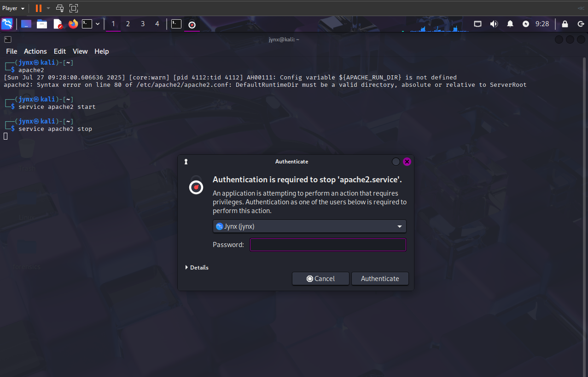

# CHAPTER 14 - USING AND ABUSING SERVICES

In Linux systems, a **service** refers to a **background application** that remains ready for use when needed. Linux distributions come with numerous pre-installed services, with the **Apache Web Server** being the most recognizable - it handles web server creation, management, and deployment. However, many other services exist beyond Apache. This chapter focuses on four services that are especially valuable for hackers: **Apache Web Server, OpenSSH, MySQL,** and **PostgreSQL.** The chapter covers establishing a web server using Apache, conducting remote surveillance through OpenSSH, retrieving data via MySQL, and organizing hacking-related information with PostgreSQL.

## [14.1] STARTING, STOPPING, AND RESTARTING SERVICES

Some services indeed can be stopped, started or restarted with Linux **GUI** as in Windows or Mac. However some service require use of the **CLI. 
Basic Syntax :**

> `service ***servicename*** start|stop|restart`
> 




 **Apache2** service - HTTP Server, which is a widely used open-source web server software. Apache2 is responsible for **serving content, such as HTML files, when a client makes a request with a website domain**.

## [14.2] CREATING AN HTTP WEB SERVER WITH APACHE

Apache Web Server stands as the most widely deployed service across Linux environments, powering more than 60 percent of global web servers. This prevalence makes Apache knowledge essential for any competent Linux administrator. For those interested in web-based security testing, understanding Apache's architecture, web functionality, and associated database systems is fundamental. Apache can also serve as a platform for creating your own web server, which could potentially host malicious scripts through cross-site scripting attacks targeting site visitors, or facilitate website cloning combined with DNS manipulation to redirect users to your server. Both scenarios require foundational Apache expertise to execute effectively.

If you don't have apche2 installed, you can get them:

```bash
apt-get install apache2
```


**Apache Web Server** frequently works alongside the **MySQL database system** (covered in the following section), and this pairing is commonly combined with scripting languages like **Perl** or **PHP** for web application development. The integration of **Linux, Apache, MySQL,** and **PHP** or **Perl** creates a robust development and deployment environment for web-based applications, collectively known as **LAMP**. This technology stack represents the most prevalent web development tools in Linux environments and enjoys significant popularity in Microsoft environments as well, where it's typically called **WAMP** (with **W** representing Windows). 

To begin using Apache, you must first launch the **Apache daemon**. In Kali Linux, navigate to Applications ▸ Services ▸ HTTPD and select Apache start. Alternatively, you can achieve the same result through command line execution with the following command:

```bash
service apache2 start
```


With Apache now active, it should be capable of displaying its default webpage. Type [http://localhost/](http://localhost/) into your preferred web browser to access the page, which should appear similar to:


Modifying the index.html File The default webpage for Apache is located at /var/www/html/index.html. You can modify this index.html file to display any content you desire, so let's build our own custom page. Any text editor will work for this task; I'll be using nano for this example. Access /var/www/html/index.html and you should observe something similar to:


Notice that the default webpage contains the identical text that appeared when we navigated to localhost in our browser, but formatted in HTML. We simply need to edit or replace this file to make our web server show the content we want.

### Creating Custom HTML Page

Lets just change the contents of the file to something to our liking like:


The Webpage now shows:


## [14.3] OPENSSH AND THE RASPBERRY SPY PI

**SSH** stands for **Secure Shell** and essentially allows us to establish secure connections to terminals on distant systems—serving as a secure alternative to the vulnerable telnet protocol that was prevalent in earlier years. When constructing a web server, SSH allows us to establish **user access controls** (defining who can utilize the service), verify users through encrypted authentication, and secure all data transmission. This minimizes the risk of unauthorized terminal access (through enhanced authentication) and communication interception (via encryption). **OpenSSH** represents the most extensively deployed Linux SSH service, coming pre-installed on virtually all Linux distributions, including Kali. System administrators frequently employ SSH for remote system management, while security researchers often utilize SSH to access compromised remote systems, which is our approach here. In this demonstration, we'll use SSH to configure a remote **Raspberry Pi device** for surveillance purposes, creating what the author of the book terms the "**Raspberry Spy Pi**" This requires a Raspberry Pi along with its corresponding **camera module**. However, first we need to initialize OpenSSH on your Kali system using this familiar command:

```bash
service ssh start
```


SSH will be utilized to construct and operate a remote surveillance Raspberry Pi system. For those unfamiliar with the device, the *Raspberry Pi is a compact yet capable computer roughly the size of a credit card that functions excellently for remote monitoring applications*. We'll implement a Raspberry Pi equipped with a camera module as our remote observation device. You can obtain a **Raspberry Pi** from most electronics stores, including Amazon, for under $50, with the camera module costing approximately $15. In this setup, we'll deploy the Raspberry Spy Pi on the same network as our Kali system, enabling us to utilize private, internal IP addresses. Naturally, in real-world scenarios, you would likely position it on a different remote network, though that would present additional complexity beyond the note’s scope.

Configuring the Raspberry Pi Ensure your Raspberry Pi operates on the Raspbian operating system, which is simply another Linux distribution specifically adapted for the Raspberry Pi processor. Download and installation guidance for Raspbian can be found at [https://www.raspberrypi.org/downloads/raspbian/](https://www.raspberrypi.org/downloads/raspbian/). Most concepts covered in this book apply equally to Raspbian OS on the Raspberry Pi as well as Kali, Ubuntu, and other Linux distributions. After downloading and installing your Raspbian OS, you'll need to connect your Raspberry Pi to a display, mouse, and keyboard, then establish internet connectivity. If these steps are unfamiliar, consult the instructions at [https://www.raspberrypi.org/learning/hardwareguide/](https://www.raspberrypi.org/learning/hardwareguide/). With everything configured, access the system using the username pi and the password raspberry.

<aside>
💡

**REFER TO THE BOOK FOR THE EXACT EXPERIMENT AND EXPLANATION**, its beyond my note’s scope for the time being. I have provided a gist for your curiosity and possible learning curve you might be interested in. 

</aside>

## [14.4] EXTRACTING INFORMATION FROM MYSQL

**MySQL** represents the most prevalent database system powering database-dependent web applications. In today's Web 2.0 environment, where virtually all websites rely on databases, MySQL essentially stores data for a significant portion of the internet. Databases serve as the primary target for security researchers, containing valuable user information and sensitive data like credit card details. This makes databases the most sought-after targets for attackers. Similar to Linux, MySQL operates under open source and general public license (GPL) terms, and comes pre-installed on most Linux distributions. Being **cost-free, open source, and robust,** MySQL has emerged as the preferred database solution for numerous web applications, including major platforms like WordPress, Facebook, LinkedIn, Twitter, Kayak, Walmart.com, Wikipedia, and YouTube. Additional popular content management systems (CMSs) including Joomla, Drupal, and Ruby on Rails also utilize MySQL. The pattern is clear: understanding MySQL is essential for developing or analyzing backend databases of web applications.

Initiating MySQL Fortunately, Kali includes MySQL in its default installation (users of other distributions can obtain MySQL from their software repository or directly from [https://www.mysql.com/downloads/](https://www.mysql.com/downloads/)). To launch your MySQL service, input the following command in the terminal:

```bash
service mysql start
```


Next, you need to authenticate yourself by logging in. Enter the following:

```bash
sudo mysql -u root -p
```

and, when prompted for a password, just press ENTER:


In MySQL's initial setup, the root user account has **no password** assigned. This represents a significant security risk that should be addressed by setting a password following your initial login. It's important to understand that MySQL usernames and passwords operate independently from your operating system's user accounts and credentials. Let's modify the MySQL root user password immediately to ensure proper security.

<aside>
💡

MySQL was originally created by MySQL AB, a Swedish company, in 1995. Sun Microsystems acquired it in 2008, and Oracle subsequently purchased Sun Microsystems in 2009, making Oracle the current owner of MySQL. Since Oracle is the world's leading database software company, the open source community harbors considerable concerns about Oracle's dedication to maintaining MySQL's open source nature. Consequently, a MySQL fork named "MariaDB" has emerged, with a commitment to preserving the software and its future releases as open source. Linux administrators and security professionals should monitor MariaDB's development closely.

</aside>

### Interacting with MySQL

SQL is an interpreted programming language designed for database interaction. Databases are typically relational, meaning information is organized across multiple interconnected tables, with each table containing data arranged in columns and rows. Various SQL implementations exist, each featuring distinct commands and syntax structures, but several fundamental commands are universal:

- **select** - Retrieves data from the database
- **union** - Merges results from multiple select statements
- **insert** - Adds new records to the database
- **update** - Modifies existing database entries
- **delete** - Removes data from the database

Each command can include conditions to specify precisely what action you want to perform. For instance, the statement:

`select user, password from customers where user='admin';` 

will extract the user and password field values for any record in the customers table where the user field contains "admin".

### Setting a MySQL Password

Let’s see what users are already in our MySQL system:

```sql
select user, host, password from mysql.user;
```


This demonstrates that the root users currently lack password protection. Let's establish a password for the root account. To accomplish this, we'll begin by choosing a database to work with. Your MySQL installation includes several pre-configured databases. Execute the 

`show databases;` command to view all existing databases:


MySQL includes three default databases, with two of them (information_schema and performance_schema) serving as administrative databases that we won't utilize in this context. We'll work with the non-administrative database called mysql, which is provided for general user purposes. To start working with the mysql database, type:

```sql
use mysql;
```


This command establishes our connection to the mysql database. Next, we can establish the root user password as **`0/jynxdomain\3`** using this command

```sql
ALTER USER 'root'@'localhost' IDENTIFIED BY '0/jynxdomain\3';
```


### Accessing a Remote Database

To connect to a MySQL database on the localhost, we employ this syntax:

`mysql -u -p`

This command automatically connects to the local MySQL instance when no hostname or IP address is specified. For remote database access, we must supply the hostname or IP address of the system running the MySQL database. Here's an illustration:

`mysql -u root -p 192.168.1.101`

This establishes a connection to the MySQL instance located at 192.168.1.101 and requests password authentication. For demonstration purposes, I'm connecting to a MySQL instance within my local area network (LAN). If you have a networked system running MySQL, substitute its IP address here. I'll assume you've successfully circumvented the password protection and gained root access (remember that MySQL databases typically have no default password). This launches the MySQL command line interface, presenting us with the mysql > prompt.

Besides this command line interface, MySQL offers GUI alternatives—both native options (MySQL Workbench) and third-party solutions (Navicat and TOAD for MySQL). As a security researcher, the command line interface may provide the most effective avenue for MySQL database exploitation, so we'll concentrate on that approach. It's improbable that as an unauthorized database user, you'll encounter a user-friendly GUI.

**NOTE** This interface reminds us that all commands require semicolon termination or \g (unlike Microsoft's SQL Server) and that assistance is available by typing help; or \h.

Now that we've authenticated as the system administrator, we can navigate the database without restrictions. Had we logged in as a standard user, our access would be constrained by the permissions assigned by the system administrator for that account.

## [14.5] PostgreSQL with METASPLOIT

**PostgreSQL**, commonly referred to as **Postgres**, is another **open source relational database** frequently deployed in large-scale, internet-facing applications because of its excellent scalability and capacity to manage substantial workloads. 
Initially launched in July 1996, it's currently maintained by a large developer community called the PostgreSQL Global Development Group. PostgreSQL comes pre-installed with Kali, though users of other Linux distributions can typically find it in their repositories and install it using this command:

```bash
sudo apt-get install postgresql
```


For security researchers, **PostgreSQL** holds special significance as it serves as the default database for Metasploit, the most extensively used penetration testing and security framework. Metasploit relies on PostgreSQL to store its modules along with scan and exploit results, facilitating efficient organization during penetration tests or security assessments. Therefore, we'll examine PostgreSQL within the Metasploit context here.
Like most Linux services, we can launch PostgreSQL using the service application start command:

```bash
service postgresql start
```


With PostgreSQL operational, let's launch **Metasploit**:

```bash
msfconsole
```


Notice that once Metasploit finishes loading, you'll see an msf > prompt. While comprehensive Metasploit instruction for security testing purposes exceeds this book's scope, we'll configure the database that Metasploit uses for information storage. With Metasploit active, we can configure PostgreSQL to store data from Metasploit operations on your system using the following command:

```bash
sudo msfdb init
```


Next, To proceed, we must access Postgres with root privileges. We'll use the su command, which stands for "switch user," to gain root access:

```bash
sudo -u postgres -i
```

This command automatically:

- Creates the database
- Sets up the user
- Configures all connections
- No manual password setup needed


Upon accessing Postgres, notice the prompt changes to `postgres@kali:/root$`, indicating the application, hostname, and current user. Our next step involves creating a user account with a password:

```bash
createuser msf_user -p
```


We establish the username **msf_user** utilizing the `–P` flag with the `createuser` command, then input your chosen password twice for confirmation. Following this, we must create the database and assign permissions to **msf_user**. We'll call the database `jynx_db`:

```bash
createdb --owner=msf_user jynx_db
```


After exiting Postgres using the exit command, the terminal returns to the `msf > prompt`. Now we must link our Metasploit console (**msfconsole**) to our PostgreSQL database by specifying:

- The username
- The password
- The host system
- The database name

For our setup, we can establish the **msfconsole** connection to our database using this command:


After exiting Postgres using the exit command, the terminal returns to the msf > prompt. Now we must link our Metasploit console (msfconsole) to our PostgreSQL database by specifying:

- The username
- The password
- The host system
- The database name

For our setup, we can establish the msfconsole connection to our database using this command:

```bash
db_connect msf_user:password@127.0.0.1/jynx_db
```


You'll need to substitute the password you created earlier. The IP address represents your local system (localhost), so 127.0.0.1 works unless you've established this database on a remote machine. Finally, we can verify the PostgreSQL database status to confirm the connection:

```bash
db_status
```


As shown, Metasploit confirms the PostgreSQL database connection is active and operational. Moving forward, when we perform system scans or execute exploits through Metasploit, the data will be saved in our PostgreSQL database. Additionally, Metasploit now maintains its modules within our Postgres database, significantly improving module search speed and efficiency!
