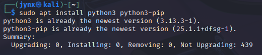

# CHAPTER 16 - PYTHON SCRIPTING BASICS

**Fundamental programming abilities** are essential for advancing to expert-level cybersecurity skills. Beginners who rely solely on **pre-built tools** without developing their own *coding capabilities* will remain at a novice level, dependent on **others' creations**. This reliance limits effectiveness and raises the risk of being detected by security systems, antivirus programs, intrusion detection software, and authorities. By developing programming skills, one can progress to advanced cybersecurity expertise and create custom solutions rather than depending on existing tools.

**Python** possesses key characteristics that make it especially **effective** for cybersecurity applications, with its **extensive collection** of **libraries** being the most significant advantage. These libraries are pre-written code modules that can be imported and utilized in projects, offering robust capabilities. Python includes more than **1,000 built-in modules**, with additional ones accessible through various repositories. While cybersecurity tools can be developed using other programming languages like bash, Perl, and Ruby, Python's rich module ecosystem significantly simplifies the development process and makes it more accessible for creating security-related applications.

## [16.1] INSTALL PYTHON

Python is usually pre-installed in kali, but to install the latest version:

```bash
sudo apt install python3 python3-pip
```



To **download** a particular module:

```bash
sudo apt install python3-requests 
#'requests' is the module name
```


**NOTE:** Your output might be different if you are installing them for the first time, I already have and thus it returns ***already installed***.

When you install packages using pip/python, they are typically stored in the **`/usr/lib/python--version/distpackages`** folder by default. For example, if you install the `**requests**` library for Python 3.6, it would be located at **`/usr/local/lib/python3.6/requests`**. 
However, since different Linux distributions may use varying directory structures, you might not always know exactly where a package is installed. 
To find the location of any installed package, you can use the command **`pip3 show`** followed by the ***package name***, which will display detailed information including the installation path.


Installing Community-Created Modules You can install third-party modules developed by Python community members (rather than official Python packages) by downloading them manually from their online sources. The process involves using **`wget`** to fetch the module from its hosting location, extracting the compressed files, and then executing the **`python setup.py install`** command. 

This method is useful when packages aren't available through pip or when you need to install from a specific source or development version.


Although this request wasn't found, but you get the idea- the module no longer exists.

## [16.2] SCRIPTING WITH PYTHON

Now that you understand **Python** module installation, let's explore fundamental Python concepts, terminology, and syntax. Following this foundation, you'll create practical scripts that demonstrate Python's capabilities for cybersecurity applications. Like bash and other scripting languages, Python scripts can be written using any text editor. For simplicity in this section, I recommend using a basic text editor like **nano**, though it's worth knowing that various integrated development environments (**IDE**s) are available for Python development. An IDE functions as an enhanced text editor with additional features such as syntax highlighting, debugging tools, and compilation support. Kali Linux includes the **PyCrust IDE** by default, and many other IDEs can be downloaded.

<aside>
💡

**Python Formatting Requirements**

As you work with Python, you'll quickly notice this formatting dependency in action. It's essential to develop good indentation habits from the start, as proper formatting is not optional but required for your code to function correctly.

This approach sets Python apart from other programming languages where formatting serves primarily as a readability tool and best practice, but doesn't affect how the code actually runs. In Python, inconsistent formatting will cause errors and prevent your code from executing properly.

The key principle is consistency rather than following specific formatting rules. For instance, if you begin a code block with a certain level of indentation (like two spaces or four spaces), you must maintain that exact same indentation pattern throughout the entire block. Python uses this consistent indentation to recognize that these lines form a cohesive group.

Unlike many other programming languages, Python treats code formatting as a fundamental requirement rather than just a style preference. The Python interpreter relies on proper formatting, especially indentation, to understand how your code is structured and which lines belong together.

</aside>

Let’s begin with a simple program for once:


Now before executing the program lets give ourselves the permissions to execute it:
**`chmod 755 Prog1.py`**


use **`python`** keyword and then your filename to execute your file:


`*#!/usr/bin/python3*`

**What it does:** This is called a "shebang" (pronounced "hash-bang")

- The `#!` tells the system this is a special comment
- `/usr/bin/python3` is the path where Python 3 is installed on most Linux/Mac systems
- **Note:** On Windows, this line is ignored but doesn't hurt to have

`name = "Jynx"`

**What it does:** Creates a variable and stores data in it

- `name` is the variable name (like a labeled box)
- `=` is the assignment operator (puts something in the box)
- `"Jynx"` is a string (text) - the quotes tell Python this is text, not code
- After this line, whenever you use `name`, Python will substitute `"Jynx"`

## Line 3: Print Statement

python

`print("Welcome to your first Python program: "+name)`

**What it does:** Displays text on the screen

- `print()` is a built-in function that outputs text
- `"Welcome to your first Python program: "` is a string literal
- `+` joins (concatenates) two strings together
- `name` gets replaced with `"Jynx"` from line 2

**→ Result:** Prints `Welcome to your first Python program: Jynx`

<aside>
💡

Understand basic data types of Python - integer, float, lists, sets, tuples, dictionary etc. they are fundamental and necessary.

Also, Python doesn't require you to announce or set up a variable ahead of time - you can simply create it and give it a value all in one step, unlike some other programming languages that make you declare the variable first.

</aside>

### Comments

Python allows you to add comments to your code, just like other programming languages. Comments are explanatory text that describe what your code does - they can be anything from brief notes to detailed explanations. Python recognizes these comments but completely ignores them when running your program.

While comments aren't mandatory, they're extremely valuable for future reference. When you revisit your code months or years later, comments help you quickly understand what you were trying to accomplish. Developers commonly use comments to clarify complex code sections or explain why they chose a specific approach.

Since the Python interpreter skips over comments entirely, they don't affect how your program runs. For single-line comments, Python uses the `#` symbol - everything after it on that line becomes a comment. When you need to write longer, multi-line comments, you can wrap your text between triple quotes (`"""`).


### Functions

Functions in Python are reusable pieces of code designed to carry out specific tasks. The `print()` command you used before is actually a function that outputs whatever information you give it. Python comes with many pre-built functions ready to use right away, with most available in your standard Python installation on Kali Linux. Additional functions can be accessed through downloadable libraries.

Here are some examples from the thousands of functions at your disposal: 

- `exit()` closes your program
- `float()` converts numbers to decimal format (like turning 1 into 1.0)
- `help()` provides information about specified objects
- `int()` removes decimal portions from numbers
- `len()` counts items in lists or dictionaries
- `max()` finds the largest value in a group
- `open()` accesses files in specified modes
- `range()` creates sequences of numbers between given values
- `sorted()` arranges list items in order
- `type()` identifies what kind of data you're working with.

Beyond using existing functions, you can build your own custom functions for specialized tasks. However, since Python already includes so many built-in options, it's smart to check if what you need already exists before creating something from scratch.

### **LISTS**

Many programming languages use arrays to store multiple items together. An array is a collection of values that you can access, modify, delete, or manipulate by referring to each item's position (called an index) within the collection.

Python, like most programming environments, starts counting positions from 0 rather than 1. This means the first item is at position 0, the second at position 1, the third at position 2, and so forth. Therefore, to get the third item in an array, you would use `array[2]`.

Python offers several ways to work with arrays, but lists are the most commonly used. Python lists are "iterable" meaning you can go through them element by element from start to finish (covered in the "Loops" section on page 198). This feature is particularly useful since we often need to search through lists for specific values, display items one at a time, or transfer elements between different lists.

### MODULES

A module is basically a chunk of code that's stored in its own separate file, allowing you to reuse it multiple times throughout your program without having to rewrite the same code over and over. To access a module or any specific code within it, you must import it first. As mentioned before, the ability to use both standard and third-party modules is what makes Python such a powerful tool for hackers. For instance, if you wanted to use the `nmap` module that was installed earlier, you would simply add this line to your script: **`import nmap`.**

### OBJECT ORIENTED PROGRAMMING (OOP)

Object-Oriented Programming (OOP) languages are designed around creating objects that mirror real-world items. Take a car as an example - it's an object with characteristics like wheels, color, size, and engine type, plus actions it can perform such as speeding up and securing the doors. In terms of regular language, think of an object as a noun, its characteristics as adjectives, and its actions as verbs.
Objects belong to classes, which serve as blueprints for making objects that share common starting features, characteristics, and actions. If we imagine a class called "cars," then our specific car (like a BMW) would be part of that car class.
Classes can also contain subclasses. Within our car class, we might have a BMW subclass, and a specific example from that subclass could be the 320i model. Every object would possess characteristics (such as brand, model, year, and color) and actions (like start, drive, and park).
In OOP languages, objects automatically receive the traits of their parent class, so the BMW 320i would automatically get the start, drive, and park actions from the broader car class. Understanding these OOP principles is essential for grasping how Python and other object-oriented languages function, which you'll see demonstrated in upcoming script examples.

## [16.3] NETWORK COMMUNICATIONS IN PYTHON

### Building a TCP Client

We’ll create a network connection in Python using the **`socket`** module.

A ***banner*** is the identifying information that an application displays when someone or something connects to it. Think of it as the application's way of introducing itself by announcing what it is. Hackers employ a method called ***banner grabbing*** to gather essential details about which application or service is operating on a specific port.


### Breaking Down the Banner Grabbing Script

**Step 1: Import the Socket Module** 
First, we import the socket module to access its networking functions and tools. The socket module handles network connections for us, providing a way for two computers (typically a server and client) to communicate with each other.

**Step 2: Create a Socket Object** 
Next, we create a variable called `s` and link it to the socket class from the socket module. This shortcut means we don't need to write out the full `socket.socket()` syntax every time - we can simply use `s` instead.

**Step 3: Establish the Connection** 
We use the `connect()` method from the socket module to establish a network connection to a specific IP address and port. Remember that methods are functions belonging to particular objects, using the syntax `object.method` (like `socket.connect`). In this example, we're connecting to IP address 127.0.0.1 (localhost) on port 22 (the standard SSH port). You can test this with another Linux or Kali instance since most have port 22 open by default.

**Step 4: Receive Data** 
After establishing the connection, we use the `recv` method to read 1024 bytes of data from the socket and store this information in a variable called `answer`. These 1024 bytes contain the banner information we're trying to capture.

**Step 5: Display the Results** 
We use the `print()` function to display the contents of the `answer` variable on screen, showing us what data was transmitted over the socket - essentially allowing us to intercept and examine it.

**Step 6: Clean Up**
Finally, we close the connection to properly terminate the session.

### Creating a TCP Listener

We've just built a TCP client that can connect to any TCP/IP address and port, then monitor the data being sent. This same socket functionality can also create a TCP listener - essentially setting up your system to wait for and accept incoming connections from external sources.

Let's explore this concept next. In the Python script, we'll build a socket that runs on any port of your choice on your system. When someone connects to that socket, it automatically gathers important information about the connecting system.

Type in the script and save it as `tcpserver.py`. Remember to make the file executable by running `chmod` to set the proper permissions.


**How the Code Works:**

**Setup Phase:**

- Creates a socket (communication endpoint) on your computer
- Binds it to IP address 127.0.0.1 (localhost) on port 9999
- Starts listening for incoming connections

**Connection Phase:**

- Waits for someone to connect (script appears to "hang" here - this is normal)
- When a client connects, it accepts the connection and shows their address

**Data Exchange Phase:**

- Continuously receives data from the connected client (up to 100 bytes at a time)
- Prints what it received to your screen
- Sends the same data back to the client (echo)
- Stops when the client disconnects

**Execution Guide:**

1. **Copy the code** into a file named `tcpserver.py`
2. **Make it executable:**
    
    `chmod +x tcpserver.py`
    
3. **Run the server:**
You'll see: `Server listening on 127.0.0.1:9999` and `Waiting for connections...`
    
    `python tcpserver.py`
    
4. **Open a NEW terminal window/tab** (keep the server running)
5. **Connect to your server:**
    
    `telnet 127.0.0.1 9999`
    
    **or**
    
    `nc 127.0.0.1 9999`
    
6. **Type messages and press Enter** - you'll see them echoed back
7. **Exit:** Press `Ctrl+C` in the client, then `Ctrl+C` in the server

You'll See:

- **Server terminal:** Shows connection info and received data
- **Client terminal:** Shows your typed messages echoed back

## [16.4]  DICTIONARIES, LOOPS, AND CONTROL STATEMENTS

### Dictionaries

Dictionaries store information in unordered key-value pairs, where each pair links a unique identifier (key) with its corresponding data (value). Think of dictionaries as labeled storage containers - you can organize items and access each one using its specific label for individual reference. Common uses include matching user IDs with usernames or linking specific security vulnerabilities to particular network hosts.

Python dictionaries function similarly to associative arrays found in other programming languages. Like lists, dictionaries can be iterated through, meaning you can use control structures such as for loops to cycle through the entire dictionary. The loop processes each dictionary element one by one, assigning it to a variable until reaching the end. This iteration capability is particularly useful for applications like password crackers, where the program systematically tests each password from a dictionary until finding a match or exhausting all possibilities.

The basic syntax for creating a dictionary follows this pattern:

```python
dict = {key1:value1, key2:value2, key3:value3...}
```

Notice that dictionaries use curly brackets `{}` and separate individual items with commas. You can include any number of key-value pairs within a single dictionary.

### Control Statements

Control statements enable your code to make decisions based on specific conditions. Python offers several methods to control how your script flows and executes. Let's examine some of these fundamental structures.

### The if Statement

The if structure in Python works like it does in many programming languages, including bash - it evaluates whether a condition is true and executes different code depending on the result. Here's the basic format:

```python
if conditional expression
    run this code if the expression is true
```

The if statement contains a condition (such as `if variable < 10`). When this condition is satisfied, the expression becomes true, and the following code block (called the control block) runs. If the condition isn't met and the statement is false, the control block gets skipped entirely.

In Python, proper indentation is crucial for the control block. This indentation tells the interpreter which code belongs to the if statement. When you write a line that isn't indented, Python understands it's outside the control block and no longer part of the if statement - this is where execution jumps to if the condition fails.

### if...else Structure

The if...else structure in Python follows this pattern:

```python
if conditional expression
    # execute this code when the condition is true
else
    # execute this code when the condition is false
```

The interpreter first evaluates the condition in the if statement. If it's true, the code in the first control block runs. If the condition is false, the code following the else statement executes instead.

For instance, consider this code that examines a user ID value: if it equals 0 (since the root user in Linux always has UID 0), it displays "You are the root user." Otherwise, for any other value, it shows "You are NOT the root user."

```python
if userid == 0
    print ("You are the root user")
else
    print ("You are NOT the root user")
```

### Loops

Loops are extremely valuable structures in Python that allow programmers to execute a block of code repeatedly based on a specific value or condition. The two most commonly used types are while and for loops.

### The while Loop

The while loop checks a Boolean expression (something that can only be true or false) and keeps running as long as that expression remains true. Here's an example that displays numbers from 1 to 10 before ending:

```python
count = 1
while (count <= 10):
    print (count)
    count += 1
```

The indented code block continues executing as long as the condition stays true.

### The for Loop

The for loop takes values from iterable structures like lists, strings, dictionaries, or other collections and assigns them to an index variable with each loop iteration. This lets you work with each item in the structure sequentially.

Here's an example showing how a for loop can test passwords until finding the correct one:

```python
for password in passwords:
    attempt = connect (username, password)
    if attempt == "230"
       print ("Password found: " + password)
       sys.exit (0)
```

In this example, the for statement cycles through a provided list of passwords, trying to establish a connection using each username and password combination. When the connection attempt returns a 230 code (indicating successful connection), the program displays "Password found:" followed by the working password, then terminates. If it doesn't receive a 230 response, it moves on to test the next password in the list until either finding a successful match or running out of passwords to try.

## [16.5]  IMPROVING SCRIPTs

Now that we have a better understanding of Python's looping structures and conditional statements, let's go back to our banner-grabbing script and enhance it with additional features.


## [16.6] EXCEPTIONS AND PASSWORD CRACKERS

Any code you create will be susceptible to errors or exceptions. In programming terminology, an exception refers to anything that interrupts your code's normal execution flow—typically an error resulting from faulty code or input. To manage potential errors, we employ exception handling, which is simply code designed to address specific problems, display error messages, or even utilize exceptions for making decisions.
Python provides the try/except structure for managing these errors or exceptions. A try block attempts to run certain code, and when an error happens, the except statement deals with that error. Sometimes, the try/except structure can be used for decision-making purposes, much like if/else statements. For example, in a password cracking application, we could use try/except to test a password and, if an error occurs because the password doesn't match, proceed to the next password using the except statement.
The described script prompts the user to input the FTP server number and username for the FTP account they wish to crack. It then loads an external text file containing potential passwords and tests each one in an attempt to breach the FTP account. The script continues this process until it either succeeds or exhausts all available passwords.


The FTP Password Cracker is a Python script designed for educational purposes to demonstrate how brute-force attacks work against FTP servers. This tool systematically attempts multiple passwords from a wordlist until it finds the correct credentials or exhausts all possibilities.

### Core Components

1. **Input Collection**: The script prompts for three essential pieces of information:
    - Target FTP server IP address
    - Username to test
    - Path to password wordlist file
2. **File Processing**: Opens and reads the password list file line by line, removing any unwanted characters (carriage returns and newlines)
3. **Connection Attempts**: For each password:
    - Establishes an FTP connection to the target server
    - Attempts login with the provided username and current password
    - Handles success/failure responses appropriately
4. **Exception Handling**: Uses try/except blocks to:
    - Handle authentication failures gracefully
    - Manage file reading errors
    - Continue operation despite connection issues

### Script Flow

> **Start → Get User Input → Open Password File → For Each Password:
├── Create FTP Connection
├── Attempt Login
├── If Success: Display Password & Exit
└── If Fail: Try Next Password**
> 

### Setting Up Your Test Environment

### → Using `vsftpd`

### Step 1: Install and Configure `vsftpd`

```bash
*# Update package list*
sudo apt update

*# Install vsftpd*
sudo apt install vsftpd

*# Create minimal configuration*
sudo tee /etc/vsftpd.conf > /dev/null << 'EOF'
listen=YES
anonymous_enable=NO
local_enable=YES
write_enable=YES
local_umask=022
chroot_local_user=NO
secure_chroot_dir=/var/run/vsftpd/empty
pam_service_name=vsftpd
ssl_enable=NO
allow_writeable_chroot=YES
EOF
```

### Step 2: Create Test User

```bash
*# Add test user*
sudo adduser ftptest
*# Set password to "test123" when prompted# Start FTP service*
sudo systemctl start vsftpd
sudo systemctl enable vsftpd
```

### Step 3: Verify Setup

```bash
*# Check if service is running*
sudo systemctl status vsftpd

*# Test manual connection*
ftp 127.0.0.1
*# Login with: ftptest / test123*
```

## Testing the Password Cracker

### Step 1: Create Password Wordlist

```bash
cat > passwords.txt << 'EOF'
123456
password
admin
test
guest
wrong
badpass
test123
password123
EOF
```

### Step 2: Run the Script

**`python3 ftpcracker.py`**

**Input when prompted:**

- **FTP Server:** `127.0.0.1`
- **Username:** `ftptest`
- **Password List:** `passwords.txt`

### Step 3: Expected Output

```
Still trying...
Still trying...
Still trying...
Success! The password is test123
```

## Conclusion

This FTP password cracker demonstrates fundamental concepts in cybersecurity and network programming. Understanding how these attacks work is crucial for implementing proper defenses. Always remember to use this knowledge ethically and only on systems you own or have explicit permission to test.

The combination of hands-on testing with proper theoretical understanding provides valuable insights into both offensive and defensive security practices.
