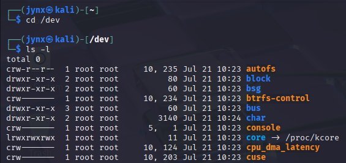

# CHAPTER 10 -  FILESYSTEM AND STORAGE DEVICE MANAGEMENT

Linux's approach to storage device representation and management appears quite different from Windows. Unlike ***Windows' drive letter system*** (C:, D:, E:), Linux uses a hierarchical file tree structure with the root directory (/) at its foundation, without physical drive representations visible in the filesystem.
This section explores how Linux handles storage devices like hard drives, flash drives, and other storage media. The focus is on understanding how additional drives and storage devices get integrated into the filesystem hierarchy through a process called ***mounting*** - essentially connecting drives or disks to the filesystem so the operating system can access them.
Understanding file and storage management is crucial for transferring data, deploying hacking tools, or even running the operating systems. When accessing a target system, it's essential to understand the storage landscape - locating sensitive files, mounting drives to targets, and determining where files can be stored on the system.

## [10.1] THE DEVICE DIRECTORY **`/DEV`**

Access the contents of /dev directory:



The devices are displayed in alphabetical order by default.

Of particular interest are the devices sda, sda1, sda2 and so on, sdb, and sdb1, which are the hard drive and its partitions and a USB flash drive and its partitions.


- `sda` - The first SCSI/SATA disk (entire disk)
- `sda1` - The first partition on that disk

Drives are sub-divided into sections known as ***partitions***. Linux employs **logical identifiers/labels** for drives that are subsequently integrated into the filesystem through mounting. These identifiers can change based on the mounting location, which means a single hard drive may receive different labels on various occasions, determined by the specific location and timing of when it gets mounted to the system.

At times, you may want to view the partitions on your Linux system to see which ones
you have and how much capacity is available in each. You can do this by using the `fdisk`
utility, with option `-l` switch.


**Disk details:**

- Device: `/dev/sda` (first SCSI/SATA disk)
- Size: 400 GiB (approximately 429 GB)
- Contains 838,860,800 sectors
- Disk model: VMware Virtual S (indicating this is running in a VMware virtual machine)
- Sector size: 512 bytes (both logical and physical)
- Disk label type: DOS (MBR partition table)
- Disk identifier: 0x1dc982b6

**Partition table:**
The bottom shows the partition layout with columns for:

- Device name
- Boot flag (bootable partition marker)
- Start/End sectors
- Total sectors
- Size
- ID (partition type code)
- Type (partition filesystem type)

When examining device files in the /dev directory, you'll notice that the first character in the file permissions is either 'c' or 'b'. This character indicates how the device handles data transfer.
The letter 'c' designates character devices, which process data one character at a time. Devices like mice and keyboards fall into this category since they send and receive information character by character in their interactions with the system.
The letter 'b' identifies block devices, which handle data in chunks or blocks (multiple bytes simultaneously). Storage devices such as hard drives and DVD drives are block devices because they need higher data transfer rates and therefore process many characters or bytes together in each operation.

## [10.2] LIST BLOCK info. with **`lsblk`**

The Linux command **`lsblk`**, short for list block, lists some basic information about each
block device listed in `/dev`.


This image displays the output of the `lsblk` command, which provides a simplified overview of block devices without requiring administrator privileges. Unlike `fdisk -l`, this command presents the information in a tree-like format that clearly shows the relationship between drives and their partitions.

The output shows:

- **sda** (8:0): The main disk drive with 400G capacity
- **sda1** (8:1): A partition on that drive with 80.1G size, mounted at the root directory (/)

The command reveals important details including device names, major/minor device numbers, sizes, and crucially, the mount points - which indicate where each device connects to the filesystem hierarchy. In this case, the sda1 partition serves as the root filesystem, as shown by its "/" mount point. The tree structure makes it easy to understand how partitions relate to their parent drives, and the tool is accessible to regular users since it doesn't need root permissions to display this storage information.

## [10.3] MOUNTING and UNMOUNTING

Contemporary operating systems, including recent Linux distributions, typically feature automatic mounting - they automatically integrate storage devices into the filesystem when connected, so new USB drives or hard drives become immediately accessible.
For Linux newcomers, the concept of mounting may seem unfamiliar. Storage devices require both physical connection and logical integration with the filesystem before the operating system can access their data. Simply plugging in a device doesn't guarantee the OS can use it - it must also be logically connected to the system.
The word "mount" originates from computing's early era when magnetic tape storage (which preceded hard drives) required physical mounting onto computer systems - similar to those large computers with rotating tape mechanisms featured in classic science fiction films.
The location where devices connect to the directory structure is called the mount point. Linux primarily uses two mount points: /mnt and /media. Generally, internal hard drives attach at /mnt, while external USB devices like flash drives and portable hard drives connect at /media. However, any directory can technically serve as a mount point.

## [10.4] How to Mount/Unmount storage devices?

**Manual Device Mounting in Investigation Scenarios.**

In forensic investigations, automatic mounting can contaminate evidence or alter timestamps. Manual mounting provides controlled access to suspect storage devices.

**Basic mounting syntax:**

```bash
mount /dev/[device] /[mount_point]
```

**DFIR Example:**
When analyzing a suspect's USB drive during incident response:

```bash
# Mount suspect's flash drive to controlled location
mount /dev/sdc1 /mnt/evidence

# Mount additional hard drive for analysis
mount /dev/sdb1 /mnt/suspect_drive
```

**Critical considerations for investigators:**

- Always use empty directories as mount points to avoid hiding existing evidence
- The `/etc/fstab` file contains system boot-time mount configurations - crucial for understanding persistent backdoors or data hiding techniques
- Mounted devices overlay directory contents, potentially concealing malicious files

## Secure Unmounting for Evidence Preservation

The `umount` command (note: no 'n') safely disconnects storage devices, similar to "ejecting" drives in GUI systems.

**SecOps Applications:**

```bash
# Safely disconnect evidence drive
umount /dev/sdc1

# Handle busy device scenarios
# (system actively accessing device - common during malware analysis)
umount /dev/sdb1  # Will fail if device is busy
```

**Investigation insight:** Failed unmounting often indicates active processes accessing the device - potentially malicious software or system processes that warrant investigation.

## Filesystem Monitoring for Threat Detection

### Disk Space Analysis with `df`

The `df` command reveals storage utilization patterns that can indicate:

- Data exfiltration activities (sudden space consumption)
- Malware staging areas (hidden partitions with unusual usage)
- Compromised systems (unexpected mounted devices)

**Example output interpretation:**

```bash
Filesystem          1KBlocks      Used  Available Use%     Mounted on
rootfs               19620732  17096196    1504788  92%     /
/dev/sdb1            29823024  29712544     110480  99%     /media/USB3.0
```

**DFIR Analysis Points:**

- **rootfs at 92% capacity**: Could indicate log file manipulation, malware installation, or data staging
- **USB device at 99% full**: Potential data exfiltration evidence or malware delivery mechanism
- **Mount point `/media/USB3.0`**: External device - investigate connection timeline and access patterns

### Storage Device Naming Convention for Investigators

Understanding Linux device naming helps in evidence tracking:

**Device identifier breakdown:**

- `sda1` = **s**ata **d**isk **a** (first), partition **1**
- `sdb1` = Second SATA device, first partition
- `sdc1` = Third SATA device (often external/USB storage)

**Investigative significance:** Device sequence helps establish connection timeline and identify evidence sources during multi-device analysis.

## Filesystem Integrity Checking for Incident Response

### Using `fsck` for Evidence Validation

The filesystem check command identifies corruption that might indicate:

- Anti-forensic techniques
- System compromise artifacts
- Data integrity issues

**Critical workflow for investigators:**

```bash
# 1. ALWAYS unmount before checking (prevents evidence contamination)
umount /dev/sdb1

# 2. Run integrity check with auto-repair
fsck -p /dev/sdb1
```

**Example healthy output:**

***File system checking finished. No errors found.***

**Red flags for SecOps teams:**

- Corrupted sectors in system areas (potential rootkit activity)
- Unusual file system versions (possible anti-forensic tools)
- Repeated bad blocks (hardware tampering or secure deletion attempts)

## Operational Security Considerations

### For DFIR Teams:

- **Write-blocking**: Always use hardware write-blockers when mounting suspect devices
- **Chain of custody**: Document all mount/unmount operations with timestamps
- **Isolation**: Mount evidence in isolated environments to prevent cross-contamination

### For SecOps Teams:

- **Monitoring**: Track unexpected device mounting activities in security logs
- **Baseline establishment**: Regular `df` checks help identify anomalous storage patterns
- **Incident containment**: Use `umount` to quickly isolate compromised storage devices

### Advanced Investigation Techniques:

- Monitor `/proc/mounts` for real-time mount information
- Check `/var/log/dmesg` for device connection logs
- Analyze mount timestamps in system logs for attack timeline reconstruction
