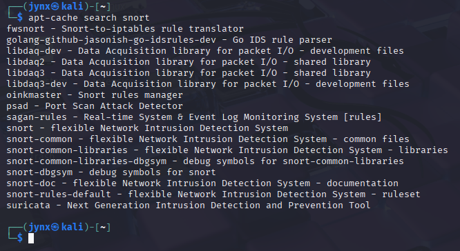

# CHAPTER 4 -  SOFTWARE

More often than not you would require installing software, utilities, dependencies to aid in your cybersecurity defensive architecture or investigating files, examining autopsy reports or memory dump scans etc. You would also find yourself as you move onwards on the journey the need and availability of ***Software Packages -*** group of files, a library of sorts that includes dependencies required to carry out a task or achieve an output. All the files and dependencies are included in the software package as separate files , often along a script, allowing software or dependency execution relatively simpler.

## [4.1] APT [Advanced Packaging Tool]

**apt** command or ***Advanced Packaging Tool*** is the default software manager in Debian-based Linux distros, such as Kali.

apt command’s primary command is: ‘**apt-get’,** it is used to ****download and or update/upgrade existing software or newer software packages.

To check whether the package required to install already exists on your system you could do so using:

```bash
apt-cache search *keyword*
```

example:



There are many results, because there are many dependencies with the word ‘snort’, try python3 and you would see a lot more than these. 

### INSTALLING a Software;

```bash
apt-get install *packagename*
```

example:


**sudo** - is used for root privileges since, my system doesn't allow installing packages for unauthorized users/groups.

I already had snort installed, thus in the last line it reads:
***’0 upgraded, 0 newly installed, 0 to remove and 307 not upgraded.’***

You would see different output, depending on the system it might also ask for whether you really want to install the package [Y/n]; answer with Y/y- as in YES and n/N- as in NO.

example:


### REMOVING a Software [Uninstalling];

To remove a software just like with installing, using apt-get but now instead of *‘install’* use *‘remove’* option.

```bash
apt-get remove *keyword*
```

example:


Yet again, you would be asked for whether you really want to un-install the package [Y/n]; answer with Y/y- as in YES and n/N- as in NO [Same way we did as for installation].

The *‘remove’* command will not and does not remove the configuration files by default, essentially allowing you to install the package again without having to reinstall all the configuration files again, to remove the configuration files as well, you can use the *‘purge’* option with **apt-get** command.

```bash
apt-get purge *keyword*
```

example: 


## [4.2] Upgrading Dependencies

To upgrade existing packages or installations on your system, use ‘**apt’** command with *‘upgrade’* option.

```bash
sudo apt upgrade
```

example:


→ It upgrades/updates all the packages, software and dependencies on your Kali system.

### Other options to try [UPDATES/UPGRADES]:

```bash
# Update package lists
sudo apt update

# Upgrade all installed packages
sudo apt upgrade

# For a more comprehensive upgrade (handles dependencies better)
sudo apt full-upgrade

# Clean up unnecessary packages
sudo apt autoremove
sudo apt autoclean
```

## [4.3] Using GitHub (GIT)

Sometimes software that aren’t yet community recognized or cater to niche creators/subjects would not be available on the open-source repositories in such a case, it might be available on GitHub, once you find your relevant GitHub repository for the particular package or dependency, clone it to your local Kali system using:
1. Check if you have installed git:

```bash
git --version
```

example:


If not, follow the instructions below:

```bash
# Install git
sudo apt update
sudo apt install git

# Clone the repository
git clone https://github.com/username/repository-name.git

# Navigate to the cloned directory
cd repository-name

#OPTIONAL:
# Check for installation instructions
cat README.md
cat INSTALL.md

# Common installation methods:
# For Python projects:
pip install -r requirements.txt
python setup.py install

# For projects with Makefile:
make
sudo make install

# For projects with install script:
chmod +x install.sh
./install.sh
```
