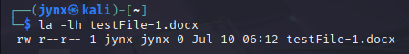

# CHAPTER 5 - FILE AND DIRECTORY PERMISSIONS

### Introduction.

Linux implements a robust permission system that controls who can access, modify, or execute files and directories. 

This security framework is essential for any multi-user environment, preventing unauthorized access and maintaining system integrity.
The permission system operates on three levels: 

- the file owner,
- designated user groups,
- and all other users.

Each level can be granted specific rights to: 

- read,
- write, or
- execute files.

This granular control allows system administrators and file owners to precisely manage access while maintaining operational security.
Understanding and properly configuring these permissions is crucial for system administrators and Defense SOC analysts, to manage and preserve enterprise environments. However, this same knowledge can be exploited by attackers who understand how to identify and leverage misconfigured permissions to gain unauthorized access.

### Types of Users.

1. **root user** - supreme leader, just kidding. But essentially, root user can do any and everything on the system [root privileges].
2. **Other users** possess relatively limited range of capabilities and permissions than root [its tangibly, extremely low than root user].
    
    → The other users are categorically differentiated in ***groups*** based on roles, relevance or department, eg. finance, accounting, vendors etc. 
    
    Essentially, the idea behind role creation:
    
    1. is to manage roles and not individual user permissions.
    2. grant/revoke permissions easily.
    3. termination/joining of user can be easily configured.
    
    → Each user inherits the permissions and privileges of group they belong to.
    

### Granting Permissions.

For standard files and directories:

- The **file owner** can always change permissions on their own files
- **Root (superuser)** can change permissions on any file
- Members of the **file's group** may have write permissions if the group permissions allow it
- **Other users** may have write permissions if the "other" permissions allow it

To change the owner of a file, you can use the **chown** [change owner] command.
**example**:




**sudo** - root privilege access
**testUser** - username of the owner you want to change *to.*

**testFile-1.docx** - file path or file name [if in the same directory]

### Checking Permissions.

Used to determine or if you wish to determine what set of permissions are granted to what users for a file or directory, find out the contents in ***/usr/share/hashcat.*** 
**example**:


### Changing Permissions.

**Decimal Notations for changing Permissions:**

> r— : 4
-w- : 2
—x : 1

rwx : 421 [4+2+1]
> 

→ when all the permission switches are on, they are represented by the octal equivalent of **7**.

 to represent all permissions for the owner, group, and all users: **777**.
→ Make changes according to user privileges you wish to assign for the (1)owner, (2)group and (3)others.

Decimal notation is the most common method for changing permissions in Linux.
However, some people find chmod’s symbolic method more intuitive—both
methods work equally well, so just find the one that suits you. 
**example**:


The symbolic method is often referred to as the **UGO** syntax, which stands for user (or owner), group, and others.
UGO syntax is very simple. 
Enter the chmod command and then the users you want to change permissions for, providing u for user, g for group, or o for others, followed by one
of three operators:- 

[ - ]: Removes a permission
[ + ]: Adds a permission
[ = ]: Sets a permission

After the operator, include the permission you want to add or remove (rwx) and, finally,
the name of the file to apply it to.

**example**: 


### Granting temporary Root Execute Permissions.

Beyond the standard read, write, and execute permissions (rwx), Linux implements three special permissions that are critical for cybersecurity professionals and digital forensics investigators to understand: **Set User ID (SUID)**, **Set Group ID (SGID)**, and the **Sticky Bit**. These permissions create unique security implications and are frequently exploited in privilege escalation attacks while also serving as crucial evidence in forensic investigations.

### Set User ID (SUID): The Double-Edged Sword

### Functionality and Purpose

The SUID bit allows a file to execute with the privileges of its owner, regardless of who runs it. This mechanism is essential for legitimate system operations but creates significant security exposure when misconfigured or exploited.

**Cybersecurity Implications:**

- SUID binaries are prime targets for privilege escalation attacks
- Attackers search for vulnerable SUID programs to gain elevated privileges
- Legitimate SUID programs can be exploited through buffer overflows, command injection, or logic flaws
- Custom SUID programs developed without security considerations pose extreme risks

**DFIR Considerations:**

- SUID files are often modified during attacks for persistence
- Unusual SUID binaries may indicate compromise or backdoor installation
- Timeline analysis should include SUID file creation/modification events
- Memory dumps may contain evidence of SUID exploitation

### Setting and Identifying SUID

The SUID bit is set by adding 4 to the octal permission notation:

```bash
chmod 4755 filename# Sets SUID with rwxr-xr-x permissions
```

**Forensic Discovery Commands:**

```bash
# Find all SUID files system-wide
find / -type f -perm -4000 2>/dev/null

# Find SUID files owned by root (high-value targets)
find / -user root -perm -4000 2>/dev/null

# Find recently modified SUID files (potential indicators of compromise)
find / -type f -perm -4000 -newermt "2024-01-01" 2>/dev/null
```

### Set Group ID (SGID): Group-Based Privilege Escalation

### Functionality and Security Impact

SGID grants temporary elevated permissions based on the file owner's group membership. When applied to directories, it ensures new files inherit the directory's group ownership, which has both legitimate uses and security implications.

**Cybersecurity Implications:**

- SGID binaries can be exploited for horizontal privilege escalation
- Shared directories with SGID may expose sensitive data to unintended users
- Misconfigured SGID permissions can lead to unauthorized access to group resources
- In multi-user environments, SGID exploitation can compromise multiple accounts

**DFIR Considerations:**

- SGID files may be used to maintain group-level access after initial compromise
- Forensic analysis should include group membership changes concurrent with SGID modifications
- Log analysis should correlate SGID file execution with user activities
- Group-based lateral movement often leverages SGID mechanisms

### Setting and Identifying SGID

The SGID bit is set by adding 2 to the octal permission notation:

```bash
chmod 2755 filename# Sets SGID with rwxr-xr-x permissions
```

**Forensic Discovery Commands:**

```bash
# Find all SGID files
find / -type f -perm -2000 2>/dev/null

# Find SGID directories (important for data exfiltration analysis)
find / -type d -perm -2000 2>/dev/null

# Combined search for both SUID and SGID
find / -type f \( -perm -4000 -o -perm -2000 \) 2>/dev/nul
```

### Sticky Bit: Legacy Security Mechanism

### Modern Context and Security Relevance

While the sticky bit has limited functionality in modern Linux systems, it remains relevant for specific security scenarios, particularly in shared directory configurations.

**Cybersecurity Implications:**

- Sticky bit on directories (like /tmp) prevents users from deleting others' files
- Absence of sticky bit on shared directories can facilitate data destruction attacks
- Attackers may modify sticky bit settings to enable file manipulation

**DFIR Considerations:**

- Changes to sticky bit settings may indicate tampering
- Forensic analysis of shared directories should verify sticky bit integrity
- Timeline analysis should include sticky bit modifications

### Identifying Sticky Bit

```bash
# Find directories with sticky bit set
find / -type d -perm -1000 2>/dev/null
```

### Privilege Escalation Attack Vectors

### Common SUID/SGID Exploitation Techniques

**Buffer Overflow Exploitation:**
Attackers target SUID/SGID programs with memory corruption vulnerabilities to gain elevated privileges.

**Command Injection:**
SUID/SGID programs that process user input without proper sanitization can be exploited to execute arbitrary commands with elevated privileges.

**Path Manipulation:**
Attackers modify PATH variables to redirect SUID/SGID programs to malicious executables.

**Shared Library Hijacking:**
Exploitation of LD_LIBRARY_PATH or similar mechanisms to load malicious libraries with elevated privileges.

**Example Attack Chain - [SPACE FOR SPECIFIC EXAMPLE]:**
[Insert detailed example of a complete privilege escalation attack using SUID/SGID, including initial access, discovery, exploitation, and post-exploitation activities]

## DFIR Investigation Methodology

### Evidence Collection

1. **System Baseline:** Document all SUID/SGID files and their legitimate purposes
2. **Timeline Analysis:** Correlate SUID/SGID modifications with system events
3. **Process Analysis:** Examine process execution logs for SUID/SGID program usage
4. **Memory Forensics:** Analyze memory dumps for evidence of privilege escalation
