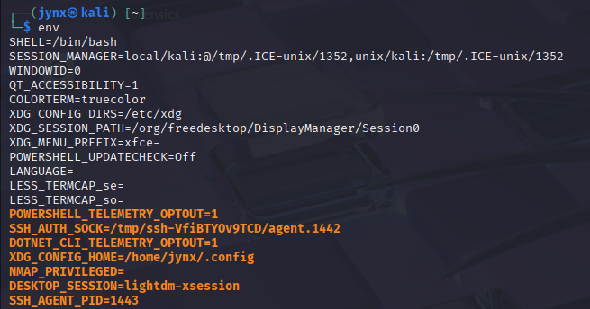

# CHAPTER 7 - MANAGING USER ENVIRONMENT VARIABLES

## [7.1] Introduction

One of the most difficult to master and hold a grasp on, also a considerably bothersome section for newbies and beginners is ***Environment Variables.***

Technically, there are 2 types of variables in Linux OS:

1. **Shell Variables** &
    
    → Shell variables persist only through a particular shell they are set in, also, typically listed in ***lower-case*** and persist for the session only.
    
2. **Environment Variables**.
    
    → Environment variables are system-wide operating variables that engage and handles the look, operation and overall feel of the system.
    

## [7.2] Viewing & Modifying Environment Variables

To view the default se to f environment variables enter `env` in the terminal.

***example :***

Environment variables are always ***UPPER-CASE***, as in HOME, PATH, SHELL, LANG and so on.

A user can also create their own custom ENV variables.

Use the `set` command to view all environment variables including shell variables, local variables and shell functions as well.

***example :*** 

***example [to view a particular variable] :***

## [7.3] Changing Variable Values

The **`*HISTSIZE*`** variable contains the value of the number of commands to store in the history file.

There are occasions when you may prefer to prevent your system from recording command history—this might be to avoid leaving traces of your actions on either your local machine or a remote system you're accessing. To accomplish this, you can configure the HISTSIZE variable to zero, which will disable the storage of previous commands entirely.

***example :***

Try moving up-down arrow key to trace previous commands, it will yield nothing. ***STEALTHY much eh?*** It can also be rather inconvenient sometimes.

Modifying an environment variable only affects the current context where the change is made—specifically, the active bash shell session. Once you exit the terminal, these modifications disappear and the variables return to their original default settings. To make these changes persistent, you must use the `export` command, which propagates the updated value from your current bash environment to the broader system. This ensures the new value remains accessible across all environments until you modify and export it once more.
***example :***

To ***reset*** the **`*HISTSIZE*`** variable to 1,000;

## [7.4] Changing Shell Prompt

If working as ‘jynx’ user in the home directory it would translate to:

`jynx@kali-[~]`

You can change the name in default shell prompt but changing the value of `ps1` variable.

The `ps1` variable has a set of information placeholders for information to be displayed in the shell prompt.

`\u`- name of the current user

`\h` - the hostname

`\w` - base name of current working directory or `pwd`

This feature proves particularly valuable when working with shell sessions across several systems or when logged in under different user accounts. By configuring distinct \u and \h values for various shells or accounts, you can quickly identify your current user identity and which system you're operating on with just a quick look.

How to change the prompt?
***example :***

Although, any subsequent shell you open or reopen the existing shell it is defaulted back to default command prompt. `*PS1*` variable only holds values for your terminal session.

To make it permanent use `export` command, as we did previously.

## [7.5] Changing `PATH` Variable

The `$PATH` variable stands as one of the most crucial environment variables, as it determines which directories your shell searches when you execute commands like cd, ls, and echo. Typically, these commands reside in sbin or bin subdirectories such as /usr/local/sbin or /usr/local/bin. When the bash shell cannot locate a command within any of the directories specified in your PATH variable, it will display a "command not found" error, even when that command actually exists in a directory that's not included in your PATH.

To look-up the directories stored in your `$PATH`variable; try `echo $PATH`

***example :***

> Each directory is separated by a colon [ : ]
> 

To add `newDFIRtools` to your PATH variable, enter the following:
`PATH=$PATH:/root/newDFIRtools`

***example :***

This assigned the original `$PATH` variable + the new path we just added `PATH=$PATH:/root/newDFIRtools`.

Now the `newFIRtools`are globally available for execution from anywhere on the system, rather than having to navigate to its directory every time for execution or usage of the tools. The bash shell will look in all directories listed for the new set of tools!

<aside>
💡

More often than not you would find yourself using some tools widely in a repetitive fashion, adding such tools to your PATH variable is a wise choice- seasoned analysts and investigators often indulge in such practices to ease their work.

</aside>

## [7.6] Creating USER_DEFINED Variable(s)

To create custom, user-defined variables in Linux, just assign a value to a new variable that is to be created and name it.

***example :***

To delete the custom variable use the unset command;

<aside>
💡

Often custom variables are used to define reusable command line arguments example `*ls=“ls -lahR”*`, it reduces redundancy and extra effort, experiment with it to fine tune your lab as a lethal *arsenal* of yours.

</aside>
