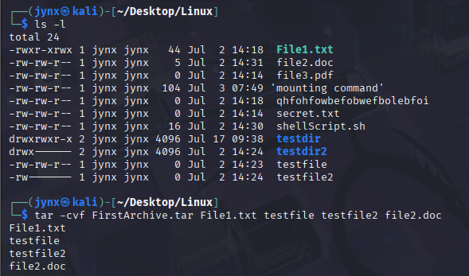

# CHAPTER 9 - COMPRESS AND ARCHIVE

## [9.1] What is Compression?

Compression as the name suggests, and most would be aware essentially, making data smaller- saving storage capacity and faster transmission due to lighter weight [size].

**Types of Compression [not all types- just for explanation sake]:**

- **Lossy** Compression
- **Lossless** Compression
    
    → Effective in reducing the size of files, but the integrity of the information is lost. The file is not exactly the same as the original one.
    
    Lossy compression works great for graphics, video, and audio files,
    where relatively smaller differences in the file are hardly noticeable—*.mp3*, *.mp4*, *.png*, and *.jpg* are all lossy compression algorithms.
    The compression ratio is very high, thus the resulting file is significantly smaller than the original one.
    
    Lossy compression cannot be used when transmitting files or software where maintaining exact data accuracy is essential. 
    For instance, when transferring scripts or documents, the original file must remain completely intact after decompression. 
    While lossless compression doesn't achieve the same level of size reduction as lossy methods, hackers typically prioritize data integrity over achieving maximum compression ratios.
    

## [9.2] Tarring Files [Archive]

Generally, before compressing files is to archive them. In most cases, to archive files- we can use the ***tar*** [ ***tape archive*** ] command.

The tar command is used to create one single archive from/of multiple files at once, it is also called a ***tar file*** or ***tarball***.

***example*** :

### Command breakdown:

`$ tar -cvf FirstArchive.tar File1.txt testfile testfile2 file2.doc` 

**Options breakdown:**

`c` - **Create** a new archive

`v` - **Verbose** mode (shows files being processed)

`f` - **File** (specifies the archive filename that follows)

**Archive name:**

`FirstArchive.tar` - The name of the archive file being created

**Files being archived:**

`File1.txt`

`testfile`

`testfile2`

`file2.doc`

 → Shows the archive file, look at the size too, makes sense since it contains multiple files.

The size although is significantly higher than their sum before compression- because the overhead can be significant with small files, it becomes less and less significant with
larger and larger files.

To display files from tarball/tar file without extracting you can by:

`t` = **Table/List** contents of the archive (don't extract, just show what's inside)

To extract those files from the ***tarball*** using the tar command, do it like:

**`x` -** Extracts (unpacks) files from an existing archive.

The files have been extracted into the current directory; you can do a long listing on the
directory to doublecheck. Note that by default, if an extracted file already exists, tar
will remove the existing file and replace it with the extracted file.

## [9.3] Compressing File

Archived files are bigger than the sum of original files. To compress those file for ease of transmission, you can try following commands [any]:

- `gzip` - uses the extension .tar .gz or .tgz
- `bzip2` - uses the extension .tar .bz2
- `compress` - uses the extension .tar .z

These all are capable of compressing our files, but they use different compression
algorithms and have different compression ratios.

Usually, compress is the fastest, but the resultant files are larger; bzip2 is the slowest,
but the resultant files are the smallest; and gzip falls somewhere in between.

### Compressing with `gzip`

Look at the file size now, significantly less than before like- ***9,983 Bytes*** smaller.

We can also decompress that same file by using the `gunzip` [GNU unzip/GNU uncompress] command.

### Compressing with `bzip2`

Similarly, To decompress;
The same file use `bunzip2` [bzip2 uncompress/bzip2 decompress] command.

### Compressing with `compress`

Similarly, To decompress;
The same file use `uncompress` command.

## [9.4] `dd` Command [*BIT-BY-BIT* ]

In cybersecurity and hacking contexts, the `dd` command is exceptionally valuable as a Linux archiving tool. 

Unlike standard file copying utilities like `cp` that only copy existing files logically, `dd` creates exact bit-for-bit duplicates of files, filesystems, or complete hard drives. This comprehensive copying method captures everything on the storage medium, including data from previously deleted files that still exists physically on the disk.

This capability makes `dd` particularly significant for two opposing groups in cybersecurity. Attackers who have compromised a system can use `dd` to clone entire drives or storage devices to their own systems for further analysis. 

Conversely, digital forensics experts rely on this same functionality to create precise copies of suspects' hard drives, preserving all data including deleted files and other digital evidence that could be crucial in cybercrime investigations.

The key advantage of `dd` over conventional copying methods is its ability to capture data that appears deleted but remains recoverable on the physical storage medium, making it an essential tool for both offensive and defensive cybersecurity operations.

It’s critical to note that the dd command should not be used for typical daytoday
copying of files and storage devices because it is very slow; other commands do the job
faster and more efficiently. It is, though, excellent when you need a copy of a storage
device without the filesystem or other logical structures, such as in a forensic
investigation.

Basic ***syntax:***

`dd if=*inputfile* of=*outputfile*`

*Creates a 10MB empty file and then Copy the disk image.*

Among the many options the most useful are the `*noerror*` option and the `*bs*` (block
size) option. As the name implies, the noerror option continues to copy even if errors are
encountered. The bs option allows you to determine the block size (the number of bytes
read/written per block) of the data being copied. By default, it is set to 512 bytes, but it
can be changed to speed up the process.

**What's happening here:**

- `bs=4096` or `bs=64k` - Uses larger block sizes for more efficient copying
- `conv=noerror` - Continues copying even when encountering read errors
- `sync` - Pads partial/error blocks with zeros to maintain proper file structure
- `status=progress` - Shows real-time progress (useful for large operations)

### **The Trade-off with Error Recovery:**

- **Larger blocks:** When an error occurs, you lose more data per failed block
- **Smaller blocks:** More granular error recovery - you can salvage data around bad sectors more precisely

**In forensics/data recovery:** You often start with larger blocks for speed, then use smaller blocks on problematic areas for maximum data recovery.

This is why forensic tools often use adaptive block sizes - big blocks for good areas, small blocks for damaged areas.

You can also try other options to explore with `dd` command.
